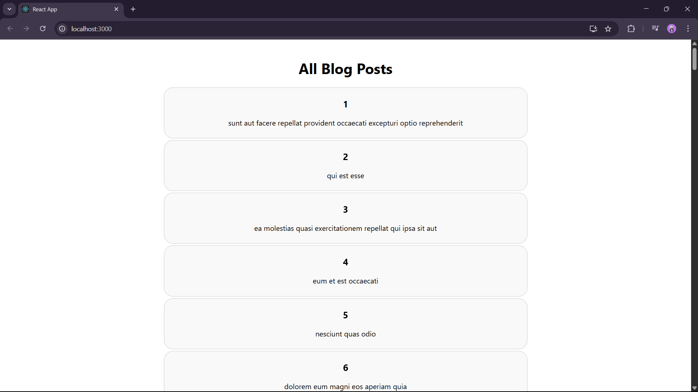

Blog App :

In this exercise, we are asked to implement componentDidMount() and componentDidCatch() and API fetch using loadPosts().

We created the blogapp project and added Post.js and Posts.js file under src.

Added the required code and verified the output of the given API output.

OUTPUT :

