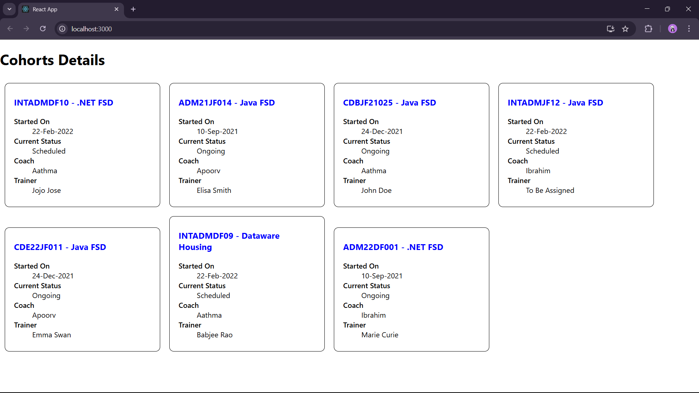

Cohort Tracker :

In this exercise, we are asked to style react component and define styles using css module.

First we extracted the zip folder provided and installed the packages.

Then created the CohortDetails.module.css file under src and added the provided code.

Then imported the css file to the CohortDetails.js file and changed the div and h3 tags as required.

After adding everything, verified the output.

OUTPUT :

