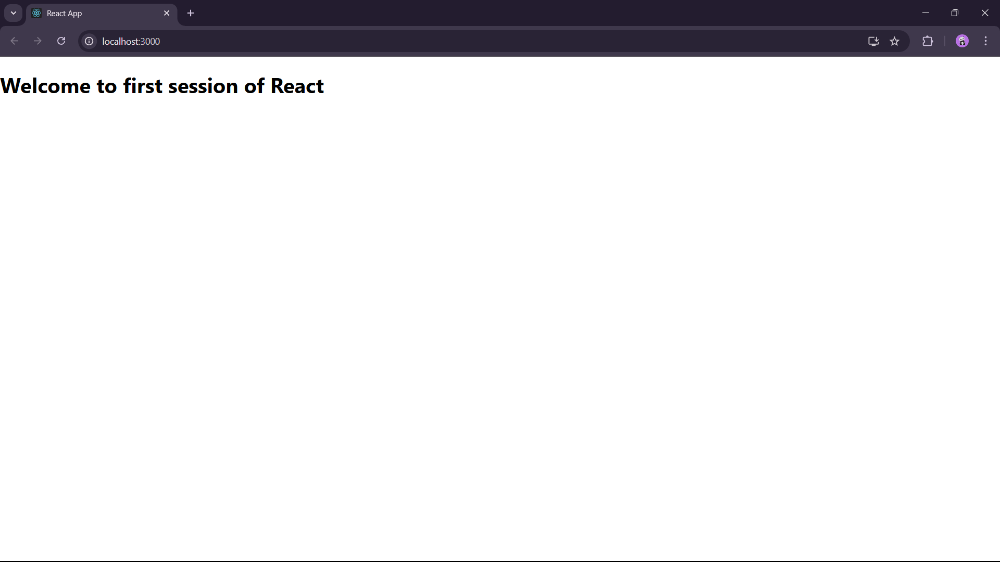

First React App :

In this Exercise we downloaded Node and installed it to work on react.

After downloading we first installed create-react-app (CRA) to use.

Then we created our first React app using the command "npx create-react-app myfirstreact".

After successfully doing it we changed the App.js file function content and verified the output.

OUTPUT :

