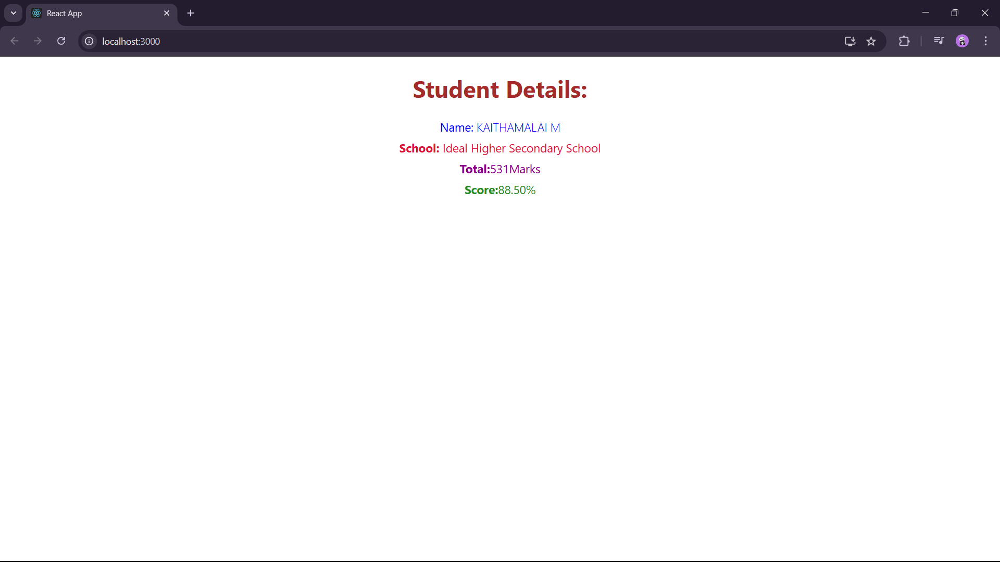

Score Calculator App :

In this exercise, we create component, appy style to the component and render them.

First we create a react app and then create a folder named Component in src.

Add the CalculateScore.js file in it and the required code.

Then add a folder named Stylesheets with a file mystyle.css in src.

Now we import this style inside the CalculateScore.js file and update the App.js file.

After changing the App.js file run and verify the output.

OUTPUT :

