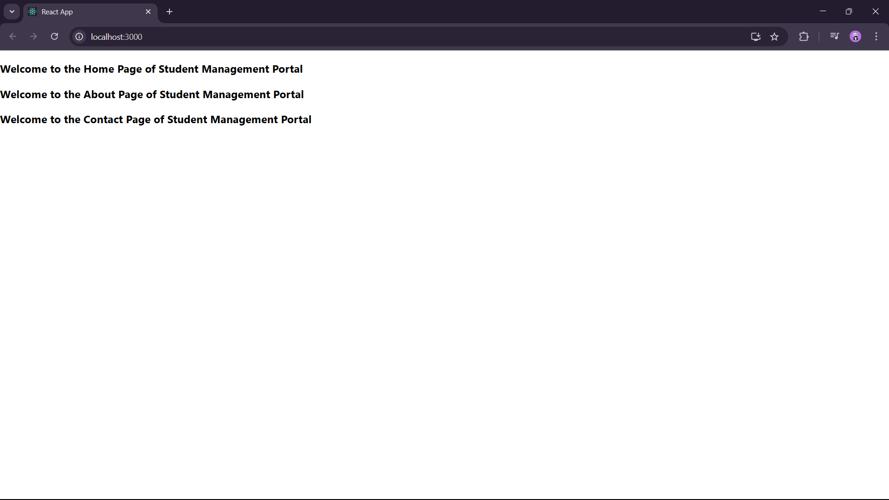

Student App :

In this Exercise, we are asked to create multiple components and render a component.

First we create a react app and created a folder Components under src.

Then added three files Home, About and Contact js files and the code given inside them.

Finally altered the App.js file with the required code and verified the output.

OUTPUT :

