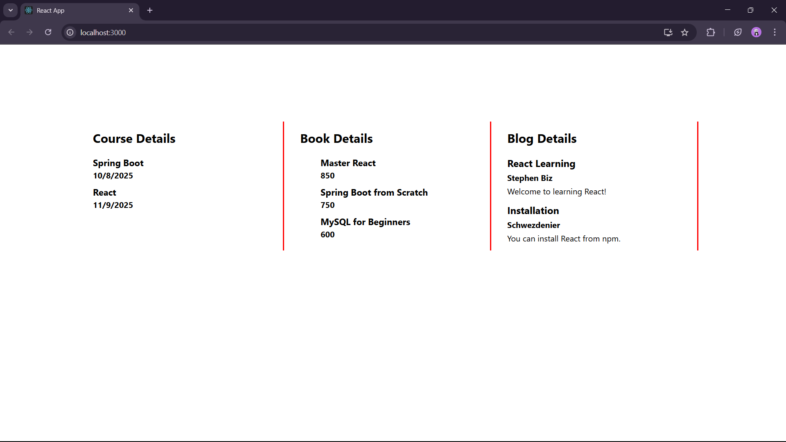

Blogger App :

In this exercise, we are asked to create components and implement them in many ways of conditional rendering.

First we created the bloggerapp react application and added the components.

Conditional rendering basically means showing or hiding something based on the condition.

We added many conditional rendering in the added components and checked the output.

OUTPUT :

